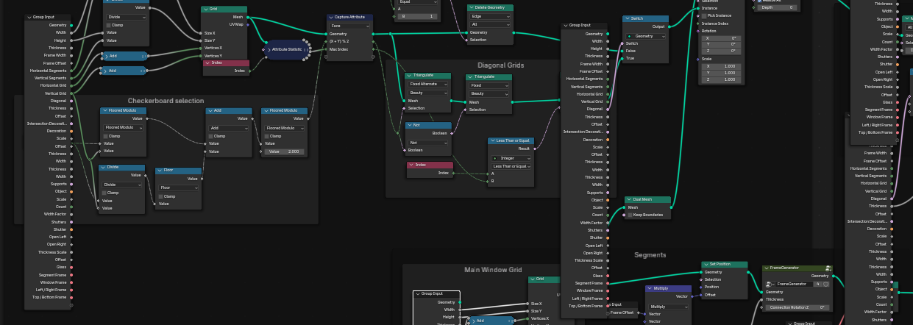
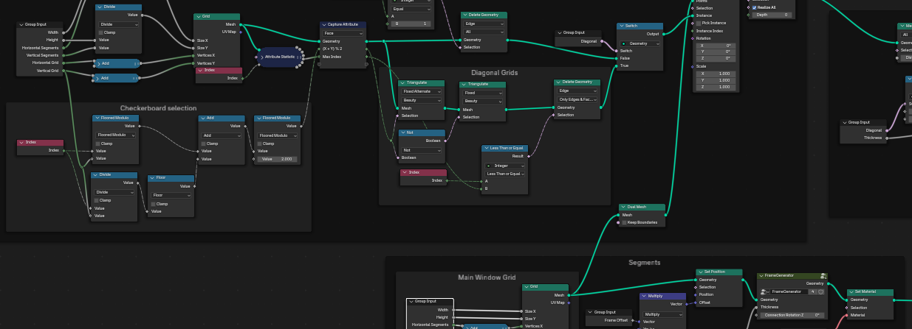
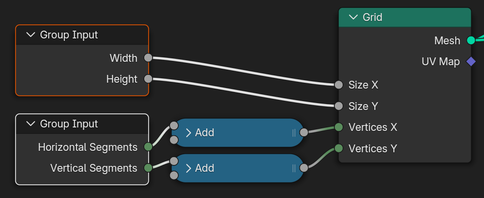
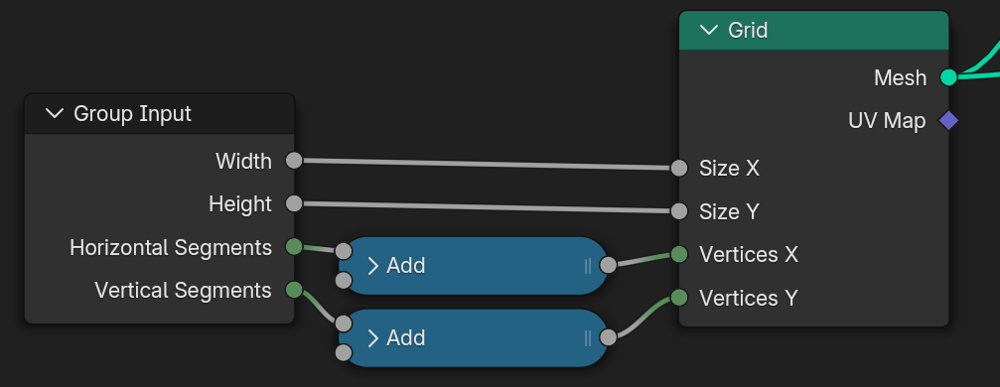
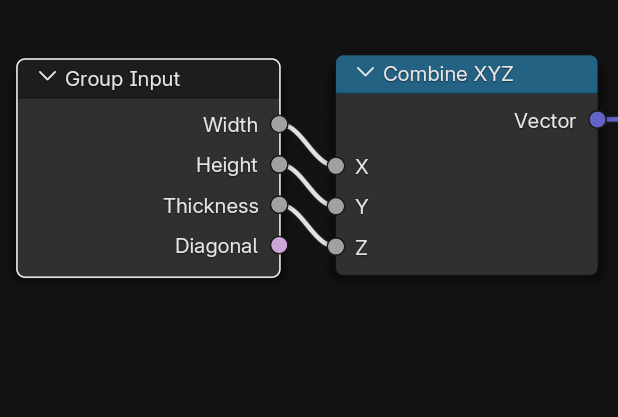
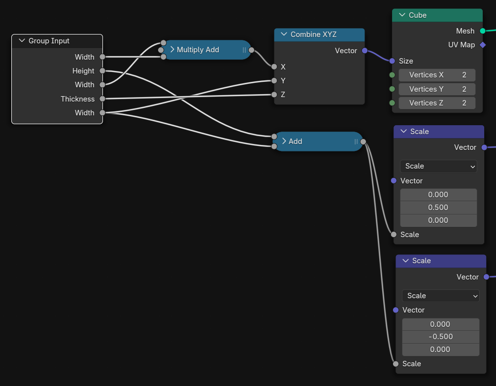
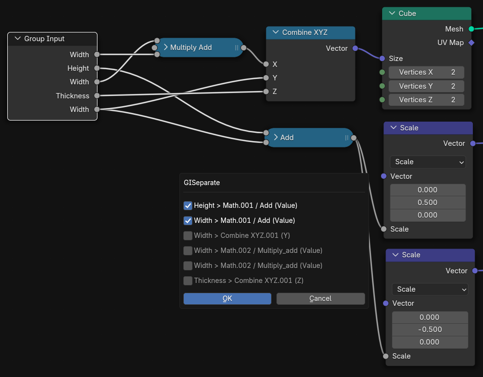
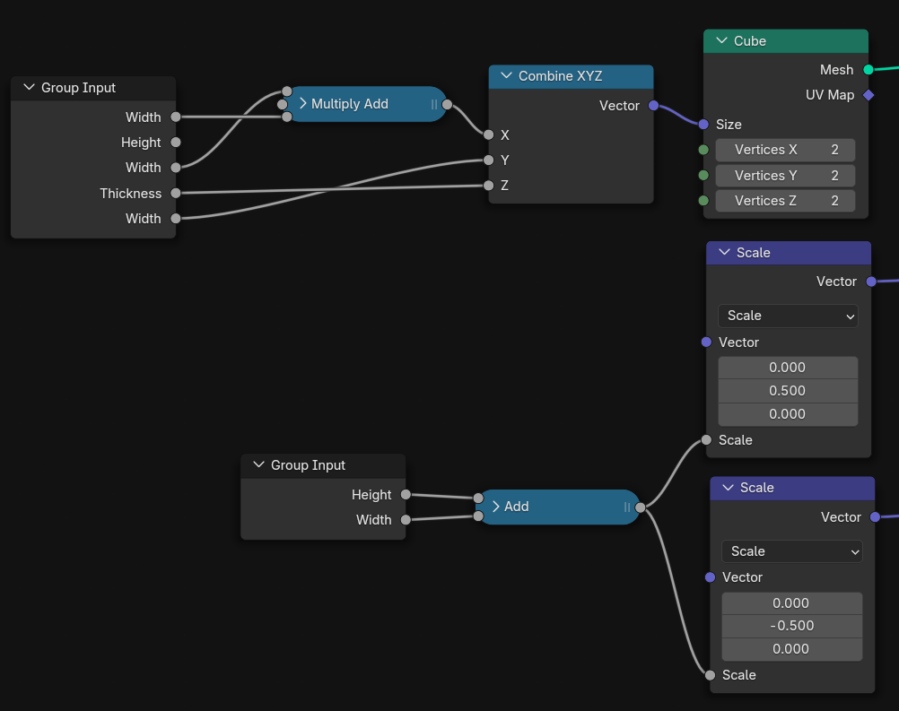

# 🌿 Group Input Utils
*A simple Blender add-on with utilities to speed up working with large Group Inputs in Geometry Nodes.*

## ✨ Why?
When dealing with large and complicated node trees, it's very important to keep workspace nice and clean. With many parameters group inputs can get VERY large and make it harder to navigate and expand existing node tree. 

This addon adds few useful functions which should speedup working with large group inputs and make our lives easier.

## ⚡ Installation
1. **Download the .zip**
   - Either download this repository as a `.zip`  
   - **OR** go to the **Actions** tab → pick the latest run → download the artifact `GIU.zip` (contains only the needed files).
2. In Blender:  
   `Edit → Preferences → Add-ons → Install from Disk...` → select the `.zip`

## ⚙️ Usage
Once installed, press **`Alt + G`** in the **Geometry Node Editor** to open the **pie menu**.  
From here, you can access all available functions:

### 🔹 Hide
Hide all unused sockets of Group Inputs in the current node tree.  

  <table>
    <tr>
      <td align="center"> </td>
      <td align="center" valign="middle">➡️</td>
      <td align="center"> </td>
    </tr>
  </table>

This was mainly useful in older version of Blender where when you added new parameter to setup, it was automatically added to all existing group input nodes. In current versions this doesn't happen anymore but I still sometimes use it.

### 🔹 Merge
Merge two or more selected Group Inputs into a single node.  

  <table>
    <tr>
      <td align="center"> </td>
      <td align="center" valign="middle">➡️</td>
      <td align="center"> </td>
    </tr>
  </table>

There are often many small group inputs with few used sockets close together. With this you can simply merge them to one group input and optionaly cleanup with reroutes.

### 🔹 Find
Unhide a specific socket in the selected Group Input via search menu.

  <table>
    <tr>
      <td align="center"> </td>
      <td align="center" valign="middle">➡️</td>
      <td align="center"> </td>
      <td align="center" valign="middle">➡️</td>
      <td align="center"> </td>
    </tr>
  </table>

I often want to reuse group input for just one input. My classic workflow was unhide all unused sockets with `Ctrl+H`, look for one specific socket, connect it and then again `Ctrl+H`. With this function you can just search for needed socket and it's automatically unhid. 

### 🔹 Separate
Split a Group Input into two by selecting links to separate.  

  <table>
    <tr>
      <td align="center"> </td>
      <td align="center" valign="middle">➡️</td>
      <td align="center"> </td>
      <td align="center" valign="middle">➡️</td>
      <td align="center"> </td>
    </tr>
  </table>

When there are many links from one group input, it can get very spaghetti like 🍝. To clean this up you can split group input into two smaller nodes by selecting links you want to separate from handy menu.

### 🔹 Usage
Show how many times a given parameter is used in the node tree (displayed in the bottom panel (it's not very useful yet xd)).

