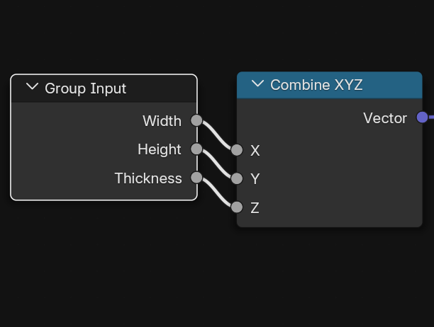
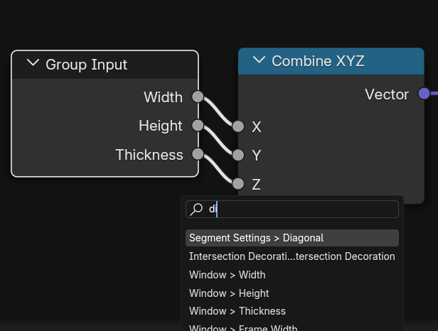

# 🌿 Group Input Utils
*A simple Blender add-on with utilities to speed up working with large Group Inputs in Geometry Nodes.*

## ✨ Why?
When dealing with large and complicated node trees, it's very important to keep workspace nice and clean. With many parameters group inputs can get VERY large and make it harder to navigate and expand existing node tree. 

This addon adds few useful functions which should speedup working with large group inputs and make our lifes easier.

## ⚡ Installation
1. **Download the .zip**
   - Either download this repository as a `.zip`  
   - **OR** go to the **Actions** tab → pick the latest run → download the artifact `GIU.zip` (contains only the needed files).
2. In Blender:  
   `Edit → Preferences → Add-ons → Install from Disk...` → select the `.zip`

## 🎮 Usage
Once installed, press **`Alt + G`** in the **Geometry Node Editor** to open the **pie menu**.  
From here, you can access all available functions:

### 🔹 GIHide
Hide all unused sockets of Group Inputs in the current node tree.  

  <table>
    <tr>
      <td align="center"> </td>
      <td align="center" valign="middle">➡️</td>
      <td align="center"> </td>
    </tr>
  </table>

### 🔹 GIMerge
Merge two or more selected Group Inputs into a single node.  

  <table>
    <tr>
      <td align="center"> </td>
      <td align="center" valign="middle">➡️</td>
      <td align="center"> </td>
    </tr>
  </table>

### 🔹 GIFind
Unhide a specific socket in the selected Group Input via search menu.

  <table>
    <tr>
      <td align="center"> </td>
      <td align="center" valign="middle">➡️</td>
      <td align="center"> </td>
      <td align="center" valign="middle">➡️</td>
      <td align="center"> </td>
    </tr>
  </table>

### 🔹 GISeparate
Split a Group Input into two by selecting links to separate.  

  <table>
    <tr>
      <td align="center"> </td>
      <td align="center" valign="middle">➡️</td>
      <td align="center"> </td>
      <td align="center" valign="middle">➡️</td>
      <td align="center"> </td>
    </tr>
  </table>

### 🔹 GIUsage
Show how many times a given parameter is used in the node tree (displayed in the bottom panel (it's not very useful yet xd)).

